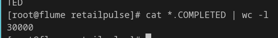
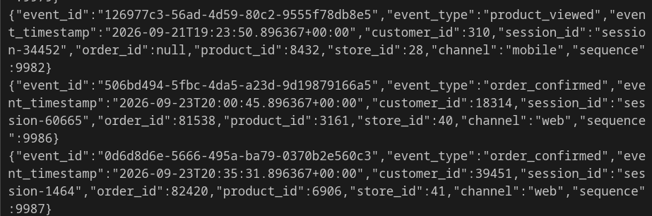
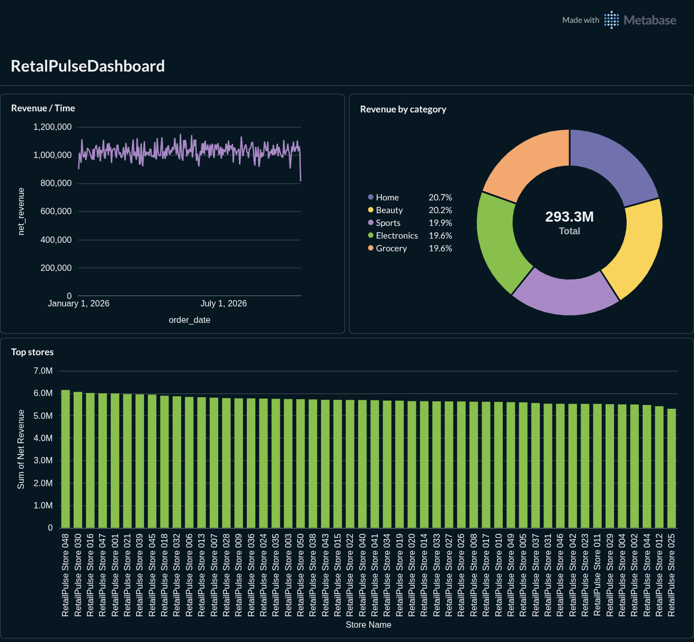
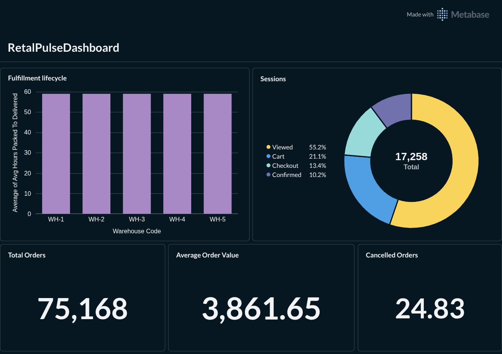
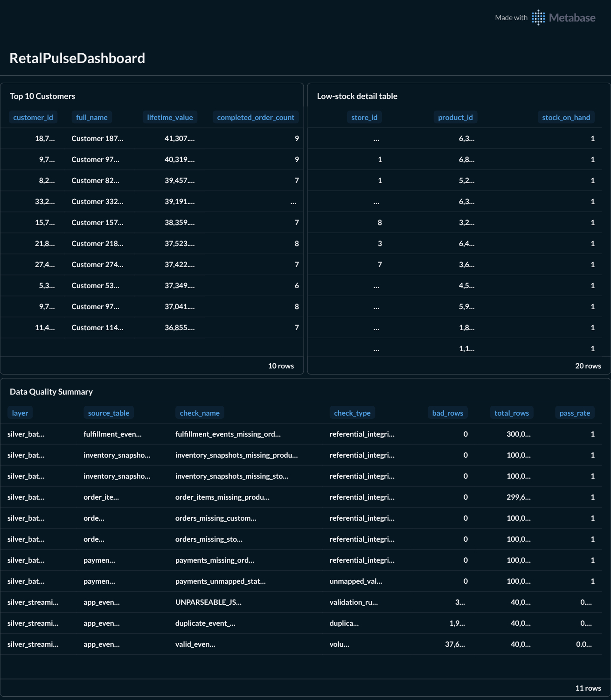

# RetailPulse Capstone Full Pipeline (Streaming + Batch + Gold + Dashboard)

End-to-end retail analytics platform: application events through Flume/Kafka/Spark on one side, PostgreSQL through Sqoop on the other, both landing in a Bronze/Silver/Gold Hive warehouse, surfaced through a Metabase dashboard.

## Repo structure

```
flume/
  retailpulse_flume.conf
spark/
  bronze_events_stream.py
  silver_events.py
  GoldLayerBatch.py
generator/
  generate_retailpulse_events.py
hive/
  01_generate_databases.hql
  02_silver_dimensions.hql
  03_silver_facts.hql
  04_gold_layer.hql
images/
  flume-completed-count.png
  kafka-sample-output.png
  Tab1.png
  Tab2.png
  Tab3.png
```

# Part 1 Streaming (Flume → Kafka → Spark → Bronze → Silver)

This half covers the application-event side of the pipeline: generating events, moving them through Flume into Kafka, landing them raw in Bronze with Spark Structured Streaming, then cleaning them up into Silver.

## 1. Kafka: create the topic first

Started with Kafka to make a topic and a consumer so I could see the output before touching Flume.

```bash
docker exec -it 07-01-kafka bash
kafka-topics.sh --bootstrap-server kafka:9092 \
  --create --topic retailpulse --partitions 6 --replication-factor 1

kafka-console-consumer.sh --bootstrap-server kafka:9092 \
  --topic retailpulse --from-beginning
```

6 partitions because I want Spark to be able to parallelize reading later, and because the message key (`session_id`) will spread across a decent number of sessions anyway. Now Kafka just sits there waiting for Flume to send it something.

## 2. Flume: spooldir -> Kafka

Config is in `flume/flume.conf`:

The `regex_extractor` interceptor pulls `session_id` out of the JSON line and uses it as the Kafka message key, so all events from one session land in the same partition (ordering within a session). File channel instead of memory so a crash mid-batch doesn't just lose events sitting in RAM.

Spooldir picks files up, renames them to `.COMPLETED` once read, and never deletes them (`deletePolicy = never`), so I still have the raw files on disk as evidence even after Kafka has them.

## 3. Generating the events

Used the generator script (`generator/generate_retailpulse_events.py`), ran it 3 times, so I should end up with 30,000 events from the generator plus whatever came before -> more on the final count below.

Checked the file count landed correctly:

```bash
docker exec -it 06-02-flume bash
cd /var/log/flume_lab/retailpulse
cat *.COMPLETED | wc -l
```



30,000 - matches.

Sample of what showed up on the Kafka consumer side:



## 4. Checking Kafka partition offsets

```bash
kafka-run-class.sh kafka.tools.GetOffsetShell --broker-list kafka:9092 --topic retailpulse
retailpulse:0:4952
retailpulse:1:4997
retailpulse:2:5049
retailpulse:3:4974
retailpulse:4:4815
retailpulse:5:5213
```

Sum of these = 30,000, which matches the file line count. Nothing lost between Flume and Kafka.

---

## 5. Bronze layer

Now that streaming into Kafka is proven, moved to Hive + Spark to actually land the data and finish Bronze.

Connect to Hive:

```bash
docker exec -it 02-03-hive-server beeline -u 'jdbc:hive2://localhost:10000/'
```

```sql
CREATE DATABASE IF NOT EXISTS retailpulse_bronze;

CREATE EXTERNAL TABLE IF NOT EXISTS retailpulse_bronze.app_events_raw (
    kafka_key        STRING,
    raw_payload      STRING,
    kafka_topic      STRING,
    kafka_partition  INT,
    kafka_offset     BIGINT,
    kafka_timestamp  TIMESTAMP,
    ingested_at      TIMESTAMP
)
PARTITIONED BY (ingest_date STRING)
STORED AS PARQUET
LOCATION 'hdfs://namenode:8020/retailpulse/bronze/app_events_raw';
```

External table since Hive isn't the one writing to it, Spark streaming is. Bronze keeps the raw payload untouched plus enough Kafka metadata (topic/partition/offset/timestamp) to trace any row back to where it came from in Kafka.

Spark job: `spark/bronze_events_stream.py`. What it does:

- reads the `retailpulse` topic from `earliest`
- keeps `key`, `value` (raw JSON string, untouched), `topic`, `partition`, `offset`, `timestamp`
- stamps `ingested_at` = when Spark actually wrote it
- partitions the Parquet output by `ingest_date`
- runs with `trigger(once=True)` so it processes what's there and stops, rather than running forever - I re-run it whenever new files show up instead of keeping a long-running stream up

Run with:

```bash
spark-submit --packages org.apache.spark:spark-sql-kafka-0-10_2.12:2.4.1 \
  /mnt/notebooks/jobs/bronze_events_stream.py
```

### Verifying Bronze

```sql
SELECT COUNT(*) FROM retailpulse_bronze.app_events_raw;
-- 40000

SELECT kafka_partition, COUNT(*), MIN(kafka_offset), MAX(kafka_offset)
FROM retailpulse_bronze.app_events_raw GROUP BY kafka_partition;
```

```
+------------------+-------+------+-------+
| kafka_partition  |  _c1  | _c2  |  _c3  |
+------------------+-------+------+-------+
| 0                | 6603  | 0    | 6602  |
| 1                | 6663  | 0    | 6662  |
| 2                | 6731  | 0    | 6730  |
| 3                | 6632  | 0    | 6631  |
| 4                | 6420  | 0    | 6419  |
| 5                | 6951  | 0    | 6950  |
+------------------+-------+------+-------+
```

```sql
SELECT COUNT(*) FROM (
  SELECT kafka_partition, kafka_offset FROM retailpulse_bronze.app_events_raw
  GROUP BY kafka_partition, kafka_offset HAVING COUNT(*) > 1) d;
-- 0
```

40,000 because I ended up running the generator 4 times total (not 3) ran one more time after the running spark to make sure it will read the new data while it's being pushed and it did, no duplicate (partition, offset) pairs, which is the real proof nothing got double-written. Bronze is done.

---

## 6. Silver layer

Now that Bronze is solid, moved to cleaning it up into Silver: parse the JSON, tag anything broken as a reject, and de-duplicate on `event_id`.

### Tables

```sql
CREATE DATABASE IF NOT EXISTS retailpulse_silver;

CREATE EXTERNAL TABLE IF NOT EXISTS retailpulse_silver.app_events (
  event_id STRING, event_type STRING, event_ts TIMESTAMP,
  customer_id INT, session_id STRING, order_id BIGINT,
  product_id INT, store_id INT, channel STRING, `sequence` BIGINT,
  kafka_partition INT, kafka_offset BIGINT, ingested_at TIMESTAMP
)
PARTITIONED BY (event_date STRING)
STORED AS PARQUET
LOCATION 'hdfs://namenode:8020/retailpulse/silver/app_events';

CREATE EXTERNAL TABLE IF NOT EXISTS retailpulse_silver.app_events_rejects (
  raw_payload STRING, reject_reason STRING,
  kafka_partition INT, kafka_offset BIGINT,
  kafka_timestamp TIMESTAMP, ingested_at TIMESTAMP
)
PARTITIONED BY (ingest_date STRING)
STORED AS PARQUET
LOCATION 'hdfs://namenode:8020/retailpulse/silver/app_events_rejects';

CREATE EXTERNAL TABLE IF NOT EXISTS retailpulse_silver.app_events_duplicates (
  event_id STRING, event_type STRING, event_ts TIMESTAMP, `sequence` BIGINT,
  kafka_partition INT, kafka_offset BIGINT, ingested_at TIMESTAMP
)
PARTITIONED BY (ingest_date STRING)
STORED AS PARQUET
LOCATION 'hdfs://namenode:8020/retailpulse/silver/app_events_duplicates';
```

Three tables: the clean events, the ones that got rejected (with a reason so I can audit them), and the ones that were duplicates (kept, not deleted, for the same reason).

### The script

`spark/silver_events.py` does the following, in order:

1. reads all of Bronze with `spark.read.parquet(...)` (never through `spark.sql`/`spark.read.table` - Spark and Hive on this stack disagree on how they write/read Parquet metadata classes, so anything that goes through the Hive metastore from Spark risks a `NoClassDefFoundError`. Reading/writing straight off the HDFS path sidesteps that completely)
2. parses `raw_payload` as JSON with `PERMISSIVE` mode
3. standardizes types (`event_id` trimmed, `event_type`/`channel` lowercased + trimmed, timestamps and numeric fields cast properly)
4. runs the data-quality rules below, first match wins, and tags each row with a `reject_reason`
5. de-duplicates whatever's left on `event_id`, using a window ordered by `ingested_at` -> `sequence` -> `kafka_partition` -> `kafka_offset`, keeping only `rn = 1`
6. writes the three outputs, overwriting the existing partitions each run

### Data-quality rules (first one that matches wins)

| #   | Rule                                                      | Reason                    |
| --- | --------------------------------------------------------- | ------------------------- |
| 1   | JSON didn't parse at all                                  | `UNPARSEABLE_JSON`        |
| 2   | `event_id` missing/empty                                  | `MISSING_EVENT_ID`        |
| 3   | `event_type` not one of the 5 known types                 | `INVALID_EVENT_TYPE`      |
| 4   | `event_timestamp` didn't parse                            | `INVALID_EVENT_TIMESTAMP` |
| 5   | `event_timestamp` more than 5 min in the future           | `FUTURE_EVENT_TIMESTAMP`  |
| 6   | `channel` not `web`/`mobile`                              | `INVALID_CHANNEL`         |
| 7   | `order_confirmed`/`fulfillment_update` with no `order_id` | `MISSING_ORDER_ID`        |

### Running it and the output

```bash
>>> print("Silver:", spark.read.parquet(
...     "hdfs://namenode:8020/retailpulse/silver/app_events"
... ).count())
Silver: 37636
>>> print("Rejects:", spark.read.parquet(
...     "hdfs://namenode:8020/retailpulse/silver/app_events_rejects"
... ).count())
Rejects: 380
>>> print("Duplicates:", spark.read.parquet(
...     "hdfs://namenode:8020/retailpulse/silver/app_events_duplicates"
... ).count())
Duplicates: 1984
```

$$37{,}636 + 380 + 1{,}984 = 40{,}000$$

Everything accounted for, nothing silently dropped.

### Verifying Silver is actually right

```sql
SELECT reject_reason, COUNT(*) FROM retailpulse_silver.app_events_rejects GROUP BY reject_reason;
```

```
+-------------------+------+
|   reject_reason   | _c1  |
+-------------------+------+
| UNPARSEABLE_JSON  | 380  |
+-------------------+------+
```

(This took a fix - originally these 380 rows were falling through to `MISSING_EVENT_ID` because `from_json` returns a null struct instead of populating `_corrupt` for these truncated lines. Added an explicit `isNull()` check on the parsed struct so rule 1 actually catches them.)

```sql
SELECT COUNT(*) - COUNT(DISTINCT event_id) FROM retailpulse_silver.app_events;
```

```
+------+
| _c0  |
+------+
| 0    |
+------+
```

No duplicate `event_id`s left in Silver. All good.

### Note on the late events / duplicates overlap

Silver's `event_date` only shows 2 dates (today and yesterday), even though the generator shifts about 3% of events back 1-3 days. Checked this against Bronze directly and it's not a bug - in the generator, the "late" check and the "duplicate" check use the same random roll and the duplicate range fully contains the late range, so almost every late-shifted event also gets its `event_id` overwritten into a duplicate. That means the late-timestamped copy correctly gets caught by dedup and routed to `app_events_duplicates` (where its true timestamp is still visible), not into `app_events`. So this is expected generator behavior, not a Silver defect - just noting it here so it doesn't look like an unexplained gap later.

---

# Part 2  Batch (Sqoop → Hive Bronze → Silver → Gold)

The relational side: 8 PostgreSQL tables from the `capstone_retail` schema on RDS, pulled with Sqoop, read into Hive, cleaned into Silver, and rolled up into Gold. Runs independently of the streaming track — they only meet later, inside Gold.

## 1. Sqoop: `stores` first, as a proof, then the rest in a loop

Older Sqoop version on this stack — no standalone `--schema` flag for Postgres, the schema has to live in the JDBC URL via `currentSchema` instead. Also had to drop `--as-avrodatafile`/`--as-parquetfile` entirely after both hit cross-version classpath errors (`NoSuchMethodError` on Avro, `NoClassDefFoundError` on Parquet) — landed everything as plain delimited text instead, `\001` as the field separator so it doesn't collide with commas inside names/addresses.

```bash
JDBC_URL="jdbc:postgresql://nti-labs.cih6ce2ewr0r.us-east-1.rds.amazonaws.com:5432/NTI?currentSchema=capstone_retail&ssl=true&sslmode=verify-full&sslrootcert=/opt/sqoop-work/global-bundle.pem"

sqoop import \
  --connect "$JDBC_URL" \
  --username postgres \
  --password-file file:///opt/sqoop-work/.pgpass.txt \
  --driver org.postgresql.Driver \
  --table stores \
  --target-dir /retailpulse/bronze/stores/full \
  --fields-terminated-by '\001' \
  --null-string '\\N' \
  --null-non-string '\\N' \
  --num-mappers 1
```

51 rows landed (case doc says \~50 — real seeded data, not a round number, confirmed no header row snuck in). Once that worked, looped the remaining 7:

```bash
TABLES=("customers" "fulfillment_events" "inventory_snapshots" "order_items" "orders" "payments" "products")

for TABLE in "${TABLES[@]}"; do
  echo "Starting import for table: ${TABLE}"
  sqoop import \
    --connect "$JDBC_URL" \
    --username postgres \
    --password-file file:///opt/sqoop-work/.pgpass.txt \
    --driver org.postgresql.Driver \
    --table "$TABLE" \
    --target-dir "/retailpulse/bronze/${TABLE}/full" \
    --fields-terminated-by '\001' \
    --null-string '\\N' \
    --null-non-string '\\N' \
    --num-mappers 1
  if [ $? -ne 0 ]; then
    echo "Error importing table: ${TABLE}" >&2
  else
    echo "Successfully imported table: ${TABLE}"
  fi
done
```

## 2. Reading Bronze into Hive

Plain external tables, `\001`-delimited, every column kept as its source type at this stage — no transformation in Bronze, same principle as the streaming side.

```sql
USE retailpulse_bronze;

CREATE EXTERNAL TABLE IF NOT EXISTS stores (
    store_id INT, store_name STRING, city STRING,
    country_code STRING, opened_at STRING
)
ROW FORMAT DELIMITED FIELDS TERMINATED BY '\001'
STORED AS TEXTFILE
LOCATION 'hdfs://namenode:8020/retailpulse/bronze/stores/full';

-- customers, products, orders, order_items, payments,
-- fulfillment_events, inventory_snapshots follow the same pattern,
-- one CREATE EXTERNAL TABLE per Sqoop target-dir.
```

Full DDL for all 8 tables follows the same `stores` pattern above, one `CREATE EXTERNAL TABLE` per Sqoop target-dir — left out of this README since it's repetitive, same shape 8 times over.

## 3. Silver — dimensions and facts (`hive/02_silver_dimensions.hql`, `hive/03_silver_facts.hql`)

**Dimensions** (`stores`, `customers`, `products`) — small tables, full reload each run, no partitioning. `customers`/`products` dedup on their PK keeping the latest `updated_at` via `ROW_NUMBER() OVER (PARTITION BY id ORDER BY updated_at DESC)`, `country_code` normalized to ISO alpha-2.

**Facts** (`orders`, `order_items`, `payments`, `fulfillment_events`, `inventory_snapshots`) — same dedup pattern, each partitioned by a derived date column (`order_date`, `payment_date`, `event_date`, `snapshot_date`), `DISTRIBUTE BY` that column so the dynamic-partition write doesn't collide. Needed to raise the partition ceiling above Hive's defaults:

```sql
SET hive.exec.dynamic.partition = true;
SET hive.exec.dynamic.partition.mode = nonstrict;
SET hive.exec.max.dynamic.partitions = 10000;
SET hive.exec.max.dynamic.partitions.pernode = 2000;
```

`order_items` failed outright without this — `orders` spans way more than the default 100-partitions-per-node cap.

## 4. Gold  split between Hive and PySpark

Wanted all of Gold in Hive. Didn't happen.

HiveServer2 on this stack runs Hive-on-MR in **local mode** (`LocalJobRunner`, no YARN) with a JVM heap that turned out to be hardcoded at `-Xmx512m` — confirmed from `ps aux`, and from the `MapJoinMemoryExhaustionHandler` log line printing `maximum memory = 477626368` (≈455MB) on every failing query. `mapreduce.reduce.memory.mb`/`mapreduce.reduce.java.opts` do nothing in local mode — those are YARN container-request params for a resource manager that doesn't exist here.

Root cause of the 512m ceiling: Hive's own `bin/hiveserver2` script appends its own `-Xmx512m` *after* whatever `HADOOP_HEAPSIZE` sets, and the JVM honors the last `-Xmx` flag — so raising `HADOOP_HEAPSIZE` alone changed nothing. Fixed it with a `docker-compose.override.yml` (new file, original repo compose untouched) setting `HIVE_SERVER2_HEAPSIZE` explicitly, then `--force-recreate` so the new env var actually landed on a fresh JVM — a plain `docker restart` doesn't pick up new env vars.

Even after bumping to 2048MB, four of the eight Gold tables were still unreliable enough (bigger joins, `COUNT(DISTINCT ...)` over large groups) that finishing on schedule meant moving them to PySpark instead of continuing to fight a single-node 512MB-class Hive:

| Stayed in Hive (`hive/04_gold_layer_hive_only.hql`) | Moved to PySpark (`spark/GoldLayerBatch.py`) |
| --- | --- |
| `customer_summary` | `daily_store_revenue` |
| `product_performance` | `payment_health` |
| `fulfillment_sla` | `inventory_health` |
| `digital_funnel_daily` | `data_quality_summary` |

Both write to the same `/retailpulse/gold/<table>` HDFS paths and register under the same `retailpulse_gold` database — invisible to Metabase/Presto which engine built which table.

One real correctness fix along the way: `daily_store_revenue` originally used `COUNT(DISTINCT CASE WHEN ... THEN order_id END)` for both `order_count` and `cancelled_count` — but `orders` is already one row per order, so the `DISTINCT` was pure overhead (Hive rewrites multiple `COUNT(DISTINCT)`s with different conditions into a much heavier plan). Dropped `DISTINCT`, results unchanged, and it stopped being one of the OOM triggers.

### Gold table reference

| Table | Grain | Source |
| --- | --- | --- |
| `customer_summary` | one row per `customer_id` | `customers` LEFT JOIN `orders` |
| `daily_store_revenue` | `(store_id, order_date)` | `orders` JOIN `stores` |
| `product_performance` | one row per `product_id` | `order_items` JOIN `products` JOIN `orders` (non-cancelled) |
| `payment_health` | `(payment_method, payment_status, payment_date)` | `payments` |
| `fulfillment_sla` | `(warehouse_code, packed_date)` | `fulfillment_events`, pivoted by `event_type` then averaged |
| `inventory_health` | one row per `(product_id, store_id)`, latest snapshot | `inventory_snapshots` |
| `digital_funnel_daily` | `(event_date, channel)` | `app_events` (streaming Silver) |
| `data_quality_summary` | `(layer, source_table, check_name, run_date)` | all Silver tables + Bronze event count |

**Known gap:** `fulfillment_sla` only holds averages, aggregated to warehouse/day before any threshold is applied — it can't answer "how many orders missed SLA," which the case asks for directly. That needs an order-grain rebuild with a defined threshold (e.g. 48h packed→delivered) and an `is_late` flag before aggregating. Not done yet.


# Part 3  Dashboard (Metabase, via Presto)

Metabase connects to Gold through **Presto** (`hive-query` profile, already provisioned in the base repo's compose file) rather than a Hive JDBC driver — Metabase's image didn't ship a Hive driver, and Presto was clearly built into this stack for exactly this bridge. Connection: Presto catalog `hive`, schema `retailpulse_gold`.

Three tabs, one per rough theme.

### Tab 1 — Revenue



- Net revenue trend, single series (`daily_store_revenue`, summed by `order_date`) — split out of an earlier 3-line combo chart that mixed currency/count/AOV on incompatible scales and was unreadable
- Revenue by category, donut (`order_items` × `orders` × `products`, non-cancelled only) — rebuilt to match the KPI number's own total after the two disagreed by \~8M; both now compute net revenue the same way
- Top stores by revenue, bar chart (`daily_store_revenue`, `Sum of Net Revenue` by `store_name`, sorted descending)
- Total net revenue, KPI number

### Tab 2 — Customers & Inventory



- Top 10 customers by lifetime value, table (`customer_summary`)
- Low-stock detail table (`inventory_health` filtered to `is_low_stock`)
- (Dropped a second "low inventory risk" tile that Metabase auto-binned `store_id`/`product_id` into numeric histograms — garbage output, not a real breakdown; this table already covers it correctly)

### Tab 3 — Fulfillment, Funnel, Data Quality



- Fulfillment lifecycle, bar chart — avg hours packed→delivered by warehouse (`fulfillment_sla`) — **placeholder until the SLA breach-count rebuild above is done**
- Digital funnel, donut (Viewed/Cart/Checkout/Confirmed session counts, `digital_funnel_daily`)
- Data-quality summary table (`data_quality_summary`, batch + streaming checks with pass rate) — was broken, fixed, now included

## Where this stands

Streaming (Flume → Kafka → Spark → Bronze → Silver)  done and verified, counts reconcile, reruns don't change the numbers.

Batch (Sqoop → Hive Bronze → Silver → Gold)  done, split across Hive and PySpark for the reasons above. Dashboard is live across 3 tabs covering 5 of the case's 6 business questions.
